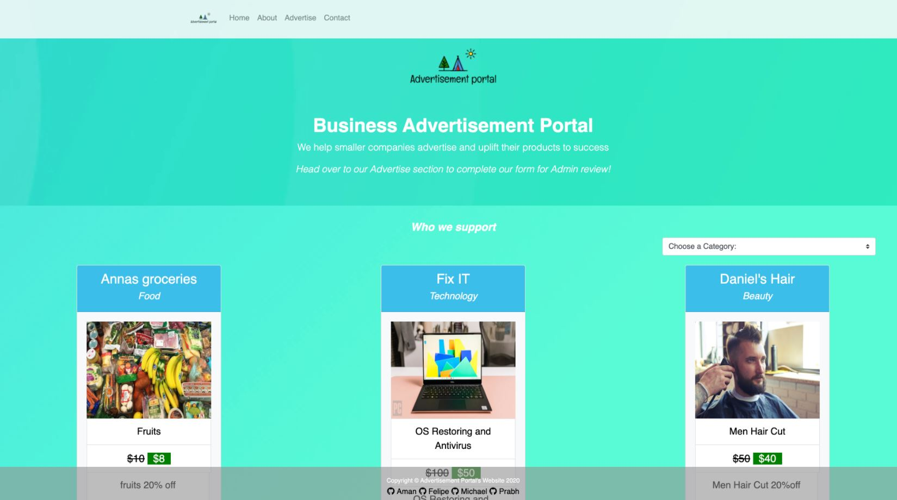
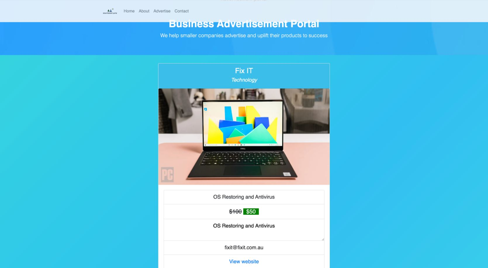

# Business Advertisement Portal (BAP)

## Description

This website provides a free advertisement channel for small/small-to-medium businesses struggling due to COVID-19. If not upfront, advertisers charge a fee based on the number of clicks or views a business obtains on their advertisement channel. BAP is basically developed to open up another avenue for product marketing, helping to improve business recognition within Sydney. BAP only advertises discounted products. That is the value proposition for people viewing the advertisements.

## Table of Contents

[Packages](#packages)                                            
[Installation](#installation)    
[Deployment](#deployment)                   
[Licenses](#licenses)  
[Contributing](#contributing)                                                                                                               
[Acknowledgements](#acknowledgements)

## Packages

* [MySQL](https://www.npmjs.com/package/mysql)- NPM package to connect to your MySQL database and perform queries.
* [Express](https://www.npmjs.com/package/express)- Fast, unopinionated, minimalist web framework for node.
* [Express Handlebars](https://www.npmjs.com/package/express-handlebars)- A Handlebars view engine for Express. 
* [Sequelize](https://www.npmjs.com/package/sequelize)- Multi dialect ORM for Node.JS.
* [Passport](https://www.npmjs.com/package/passport)- Passport is Express-compatible authentication middleware for Node.js.
* [Bcrypt](https://www.npmjs.com/package/bcrypt)- A library to help you hash passwords.
* [ESLint](https://www.npmjs.com/package/eslint)- An AST-based pattern checker for JavaScript.

## Installation

1. Clone this repo.
2. Create a database in MySQL Workbench. No tables need to be created.
3. Change the MYSQL_KEY & MYSQL_DB values in the .env file to _Workbench PWD_ & _DB Name_ respectively. If you don't see a .env file then create one with the    keys MYSQL_HOST=localhost, MYSQL_USER=root, MYSQL_KEY=_Workbench PWD_, DB=_DB Name_
4. Run 'npm i' to install all dependencies.
5. Run 'npm start' to start the website & open https://localhost:8080

## Deployment

<a href="https://business-advertisement-portal.herokuapp.com/">Link to the Business Advertisement Portal</a>

## Licenses

The underlying source code used to format and display this content is licensed under the 

## Contributing

<a href="https://github.com/amankmr4">Aman Kumar</a> 
<a href="https://github.com/Michaelmw17">Michael Watt</a> 
<a href="https://github.com/felipesqf">Felipe Ferreira</a> 
<a href="https://github.com/prabhm512">Prabh Singh</a> 

## Acknowledgements

Trilogy USYD Educational Team - Jack McNicol, Sandes and Ali Shaikh

Simple File Upload (Heroku Add-On) - Colleen Schnettler
